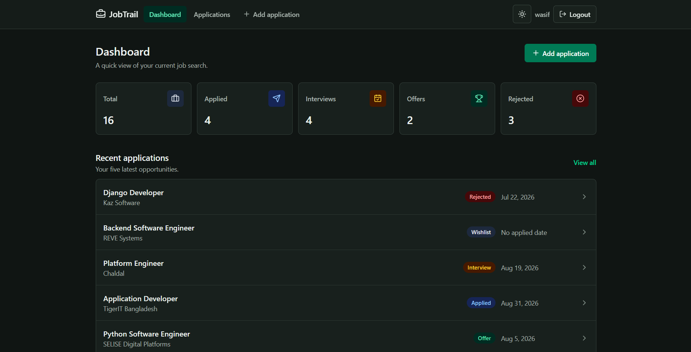
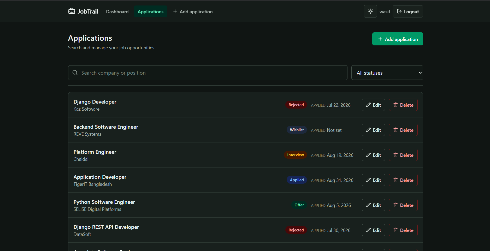
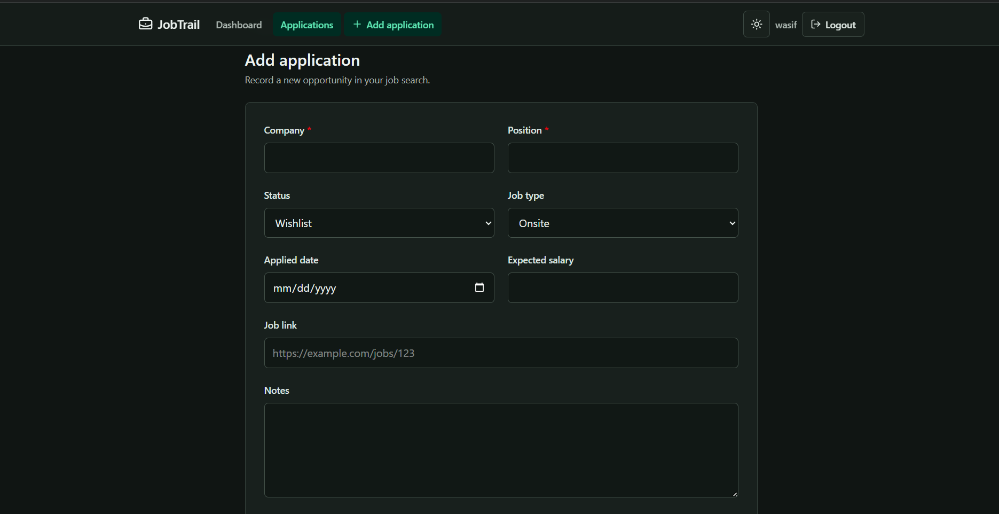
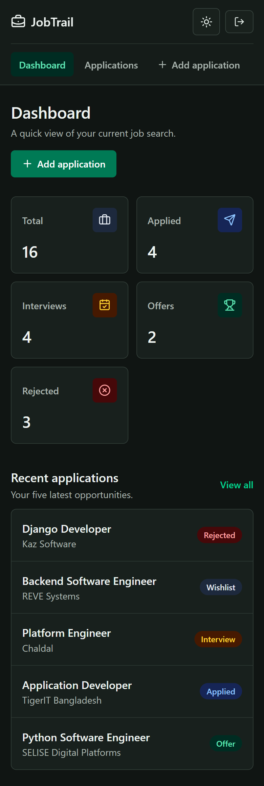

# JobTrail Frontend

JobTrail is a private job application tracker for organizing opportunities through the Wishlist, Applied, Interview, Offer, and Rejected stages. This repository contains the React frontend; all displayed application data is loaded from the JobTrail API.

## Related Repository

- [JobTrail Backend](https://github.com/wasifibnharun/jobtrail-backend)

## Tech Stack

- React 18 and TypeScript
- Vite
- React Router 6
- Axios
- Tailwind CSS 4
- Lucide React

## Features

- JWT login, registration, logout, and persistent authentication
- Protected application routes
- API-powered dashboard statistics and recent applications
- Server-side search, status filtering, and pagination
- Shared add and edit form with field-level API validation errors
- Accessible delete confirmation modal with Escape-key support
- Loading, empty, filtered-empty, and retryable error states
- Persistent light and dark modes with system-preference detection
- Responsive layouts tested at a 390 px viewport

## Setup

### Prerequisites

- Node.js 20 or newer
- npm
- The JobTrail backend running locally

### Installation

```bash
git clone https://github.com/wasifibnharun/jobtrail-frontend.git
cd jobtrail-frontend
npm install
```

Create a local environment file from the example:

```bash
cp .env.example .env
```

On Windows PowerShell, use:

```powershell
Copy-Item .env.example .env
```

The default development configuration is:

```env
VITE_API_URL=http://127.0.0.1:8000/api
```

Start the frontend:

```bash
npm run dev
```

Open `http://localhost:5173`. The `.env` file is intentionally ignored by Git, and Vite must be restarted after changing it.

## Available Scripts

| Command | Purpose |
| --- | --- |
| `npm run dev` | Start the Vite development server |
| `npm run build` | Type-check and create a production build |
| `npm run lint` | Run ESLint |
| `npm run preview` | Preview the production build locally |

## Routes

| Route | Access | Screen |
| --- | --- | --- |
| `/login` | Public | Login form |
| `/register` | Public | Registration form |
| `/` | Protected | Dashboard and recent applications |
| `/applications` | Protected | Searchable and paginated application list |
| `/applications/new` | Protected | Add application form |
| `/applications/:id/edit` | Protected | Edit application form |

Protected routes redirect unauthenticated visitors to `/login`. Authentication tokens and the selected color theme persist across browser refreshes.

## Screenshots

### Dashboard



### Applications



### Application Form



### Mobile View



## Design Direction

JobTrail uses a clean, calm workspace design intended for frequent scanning and repeated actions. Neutral surfaces and restrained borders keep the interface focused, while emerald actions and distinct status colors provide hierarchy. Light and dark themes use the same layout and semantic colors so the experience remains familiar in either mode.

## Optional Enhancements

- **O-9:** The backend includes automated coverage for authentication, owner isolation, filtering, pagination, CRUD behavior, and statistics.
- **O-15, partial:** The frontend includes a persistent dark-mode toggle and a genuinely responsive layout. Silent access-token refresh is not implemented yet.

## With More Time

- Add silent JWT access-token refresh and request replay
- Keep filters and pagination in the URL
- Add a full application detail page and activity timeline
- Add a drag-and-drop Kanban board for status changes
- Add charts for application activity and status distribution
- Deploy both repositories and provide a non-personal demo account
